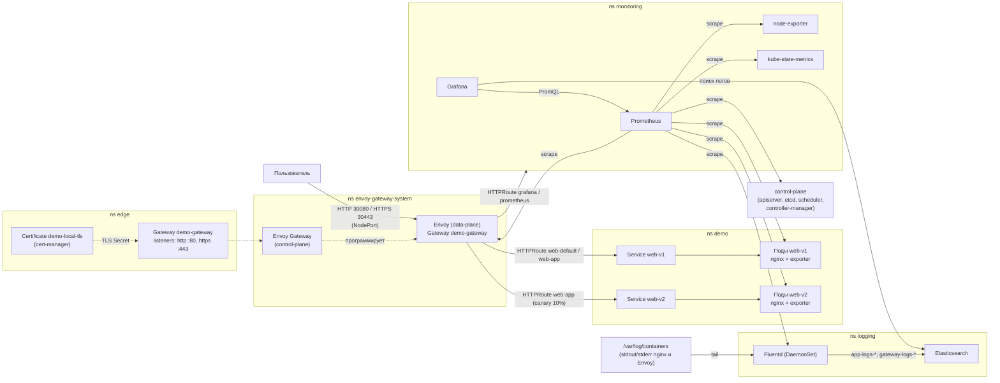

# Demo platform: Kubernetes (kubeadm) + Gateway API + Prometheus + Fluentd

[](https://github.com/aqwckk/MTC-Engineer-Hack/actions/workflows/ci.yml)

Решение DevOps-кейса хакатона «MTC ENGINEER HACK». Одна команда (`./deploy.sh` или `make deploy`) на чистой Ubuntu 24.04 устанавливает Ansible, готовит узел и поднимает single-node кластер Kubernetes через kubeadm (containerd 2.x, CNI Cilium). Затем Helm-ом ставятся cert-manager, Envoy Gateway (реализация Gateway API) и kube-prometheus-stack, а `kubectl apply -k k8s/` применяет Gateway и HTTPRoute, приложение nginx (v1 и v2), конвейер Fluentd -> Elasticsearch, мониторы Prometheus, алерты и дашборд Grafana. Приложение отдаёт `Hello World!` через Gateway API на NodePort 30080 (HTTP) и 30443 (HTTPS). Секреты (пароли Elasticsearch и Grafana) генерируются при развёртывании, в Git их нет. Команда `make verify` запускает smoke-тесты всех обязательных частей.

Тестировалось на Ubuntu 24.04.4 LTS (arm64, виртуальная машина Lima) и на GitHub Actions runner `ubuntu-24.04` (amd64).

## Оглавление

1. [Быстрый старт](#1-быстрый-старт)
2. [Архитектура](#2-архитектура)
3. [Технологии и версии](#3-технологии-и-версии)
4. [Требования к среде](#4-требования-к-среде)
5. [Пошаговая инструкция по развёртыванию](#5-пошаговая-инструкция-по-развёртыванию)
6. [Структура репозитория](#6-структура-репозитория)
7. [Проверка доступности приложения через Gateway API](#7-проверка-доступности-приложения-через-gateway-api)
8. [Проверка мониторинга](#8-проверка-мониторинга)
9. [Проверка логирования](#9-проверка-логирования)
10. [Дополнительные возможности](#10-дополнительные-возможности)
11. [Безопасность и секреты](#11-безопасность-и-секреты)
12. [Известные ограничения](#12-известные-ограничения)
13. [Диагностика](#13-диагностика)

## 1. Быстрый старт

На чистой Ubuntu 24.04 (пользователь с sudo):

```bash
git clone https://github.com/aqwckk/MTC-Engineer-Hack.git
cd MTC-Engineer-Hack
./deploy.sh
make verify
```

`./deploy.sh` — полное развёртывание (то же самое: `make deploy`; если sudo просит пароль — `./deploy.sh -K`). `make verify` — smoke-тесты: Gateway API, мониторинг, логирование.

Проверка приложения (`NODE_IP` — адрес узла, его же выводит `make info`):

```bash
NODE_IP=$(kubectl get nodes -o jsonpath='{.items[0].status.addresses[?(@.type=="InternalIP")].address}')
curl http://${NODE_IP}:30080/
```

```text
Hello World!
```

Адреса сервисов и пароль Grafana: `make info`.

## 2. Архитектура



Namespace и их содержимое:

| Namespace | Что внутри |
|---|---|
| `kube-system` | компоненты control-plane kubeadm, Cilium (CNI), metrics-server |
| `cert-manager` | cert-manager, корневой сертификат `demo-root-ca` |
| `envoy-gateway-system` | Envoy Gateway (control-plane), поды Envoy (data-plane, 2 реплики, Service NodePort 30080/30443), EnvoyProxy `nodeport-proxy`, PodMonitor'ы |
| `edge` | Gateway `demo-gateway`, Certificate `demo-local-tls` (Secret `demo-local-tls`) |
| `demo` | Deployment `web-v1` (2-5 реплик, HPA) и `web-v2` (1 реплика), Service `web-v1` / `web-v2`, HTTPRoute `web-default` и `web-app`, HPA и PDB, NetworkPolicy, ServiceMonitor `web` |
| `monitoring` | kube-prometheus-stack (Prometheus Operator, Prometheus, Grafana, node-exporter, kube-state-metrics), HTTPRoute `https-redirect` / `grafana` / `prometheus`, PrometheusRule `demo-platform`, дашборд Grafana, Secret `grafana-admin` |
| `logging` | StatefulSet `elasticsearch`, DaemonSet `fluentd`, Secret `elasticsearch-credentials`, NetworkPolicy, PodMonitor `fluentd` |
| `local-path-storage` | local-path-provisioner (манифест апстрима, StorageClass `local-path` по умолчанию) |

## 3. Технологии и версии

Единая точка управления версиями — `ansible/group_vars/all.yml`; версии образов — в манифестах `k8s/`.

| Компонент | Версия | Назначение |
|---|---|---|
| Kubernetes (kubelet, kubeadm, kubectl) | 1.37.1 | кластер; пакеты из `pkgs.k8s.io`, зафиксированы через `apt-mark hold` |
| kubeadm | 1.37.1 | способ создания кластера (`kubeadm init --config`, API `kubeadm.k8s.io/v1beta4`) |
| containerd | 2.x (пакет `containerd.io` из репозитория Docker, версия не пинится) | container runtime, cgroup driver systemd |
| Cilium | 1.20.2 (Helm-чарт) | CNI и применение NetworkPolicy (kube-proxy остаётся штатным) |
| Helm | v3.22.0 | установка компонентов платформы |
| Envoy Gateway | v1.9.2 (Helm-чарт `oci://docker.io/envoyproxy/gateway-helm`) | реализация Gateway API (controllerName `gateway.envoyproxy.io/gatewayclass-controller`) |
| CRD Gateway API | поставляются чартом Envoy Gateway | `gateway.networking.k8s.io/v1` |
| cert-manager | v1.21.2 (Helm-чарт) | выпуск TLS-сертификатов (собственный CA) |
| kube-prometheus-stack | 91.9.0 (Helm-чарт) | Prometheus Operator, Prometheus, Grafana, node-exporter, kube-state-metrics |
| nginx | `nginxinc/nginx-unprivileged:1.31.6-alpine` | демонстрационное приложение |
| nginx-prometheus-exporter | `nginx/nginx-prometheus-exporter:1.5.3` | метрики nginx (sidecar) |
| Fluentd | `fluent/fluentd-kubernetes-daemonset:v1.19.3-debian-elasticsearch8-1.1` | сбор логов |
| Elasticsearch | `docker.elastic.co/elasticsearch/elasticsearch:8.19.22` | хранение и поиск логов |
| busybox | `busybox:1.37.0` | init-контейнер Fluentd (ожидание Elasticsearch) |
| local-path-provisioner | v0.0.37 | динамические PersistentVolume на диске узла |
| metrics-server | v0.9.0 | метрики для HPA и `kubectl top` |
| Ansible | из репозитория Ubuntu 24.04 (пакет `ansible`, ставится `deploy.sh`) | автоматизация |

Обязательные сведения:

- Версия Kubernetes: **1.37.1**.
- Способ создания кластера: **kubeadm** (single-node: control-plane и рабочие нагрузки на одном узле, taint `control-plane` снимается автоматически).
- Реализация Gateway API: **Envoy Gateway v1.9.2**.
- Инструмент логирования: **Fluentd**.
- ОС тестирования: **Ubuntu 24.04.4 LTS** (arm64, ВМ Lima; amd64 — GitHub Actions runner `ubuntu-24.04`).

## 4. Требования к среде

- Ubuntu 24.04, архитектура amd64 или arm64 (playbook проверяет ОС и архитектуру).
- 4 vCPU, 8 ГБ RAM, 30 ГБ диска.
- Доступ в интернет (apt-репозитории, Helm-чарты, образы контейнеров, манифесты с GitHub).
- Пользователь с sudo.
- Свободные порты 6443 (API Kubernetes), 30080 (HTTP) и 30443 (HTTPS); `ufw` выключен либо порты открыты.

## 5. Пошаговая инструкция по развёртыванию

```bash
./deploy.sh
```

`deploy.sh` проверяет, что запущен на Linux, при необходимости ставит Ansible (`apt-get install ansible`) и запускает `ansible-playbook site.yml`, передавая ему все аргументы. Развёртывание выполняется на той же машине (inventory `ansible/inventory/local.yml`, `ansible_connection: local`).

Этапы (`ansible/site.yml`):

Play 1, тег `cluster` (с повышением привилегий):

| № | Роль | Что делает |
|---|---|---|
| 0 | pre_tasks | проверка: Ubuntu >= 24.04, архитектура x86_64 или aarch64 |
| 1 | `node_prereqs` | базовые пакеты; отключение swap и удаление из `/etc/fstab`; модули ядра `overlay`, `br_netfilter`; sysctl (`ip_forward`, `bridge-nf-call-*`, `vm.max_map_count=262144` для Elasticsearch, лимиты inotify для Fluentd) |
| 2 | `containerd` | репозиторий Docker, пакет `containerd.io` (2.x), конфиг с `SystemdCgroup = true`, настройка `crictl` |
| 3 | `kubernetes` | репозиторий `pkgs.k8s.io`, установка kubelet/kubeadm/kubectl версии 1.37.1, `apt-mark hold` |
| 4 | `cluster` | генерация `/etc/kubernetes/kubeadm-config.yaml`, `kubeadm init` (если ещё не выполнялся), выдача `~/.kube/config` пользователю, снятие taint `control-plane`; метрики etcd, scheduler, controller-manager и kube-proxy открываются для Prometheus |
| 5 | `helm` | установка Helm v3.22.0 в `/usr/local/bin` |
| 6 | `cni` | Cilium (`helm-values/cilium.yaml`), ожидание Ready узла |

Play 2, тег `platform` (от имени пользователя, роль `platform`):

1. local-path-provisioner (`kubectl apply -k k8s/storage`) и metrics-server (`k8s/metrics-server`).
2. cert-manager (`helm-values/cert-manager.yaml`).
3. Envoy Gateway (`helm-values/envoy-gateway.yaml`, вместе с CRD Gateway API).
4. Namespace `monitoring` и `logging`; генерация секретов `elasticsearch-credentials` (копия в `monitoring`) и `grafana-admin` — только если ещё не созданы.
5. kube-prometheus-stack, релиз `kps` (`helm-values/kube-prometheus-stack.yaml`).
6. `kubectl apply -k k8s/`: Gateway, приложение, мониторинг, логирование.
7. Ожидание готовности: Gateway `Programmed`, Certificate `Ready`, Deployment `web-v1`/`web-v2`, StatefulSet `elasticsearch`, DaemonSet `fluentd`, Deployment `grafana`, StatefulSet `prometheus-kps-prometheus`.
8. Итоговое сообщение с командой проверки.

Цели Makefile:

| Команда | Что делает |
|---|---|
| `make help` | список команд |
| `make deploy` | полное развёртывание (`./deploy.sh`) |
| `make cluster` | только узел и кластер (`./deploy.sh --tags cluster`: роли 1-6) |
| `make platform` | только содержимое кластера (`./deploy.sh --tags platform`) |
| `make verify` | smoke-тесты (`./scripts/verify.sh`) |
| `make info` | адреса сервисов и учётные данные (`./scripts/info.sh`) |
| `make load` | 300 тестовых запросов (`./scripts/load.sh 300`) для наполнения метрик, дашборда и логов |
| `make status` | узлы, поды, ресурсы Gateway API |
| `make lint` | yamllint, shellcheck, `kubectl kustomize k8s`, `ansible-playbook --syntax-check` (нужны установленные инструменты) |
| `make destroy` | удалить кластер с узла (`./scripts/destroy.sh`, спрашивает подтверждение; `--yes` — без вопроса) |

Флаги `deploy.sh` передаются в `ansible-playbook`:

```bash
# только узел и кластер
./deploy.sh --tags cluster
# только платформа и приложение
./deploy.sh --tags platform
# запросить пароль sudo
./deploy.sh -K
```

Время полного развёртывания — примерно 10-15 минут (зависит от скорости сети).

Повторный запуск безопасен: `kubeadm init` пропускается, если есть `/etc/kubernetes/admin.conf`; пакеты и Helm ставятся только при несовпадении версий; секреты не пересоздаются; Helm-релиз обновляется только при изменении версии чарта или файла values (контрольная сумма values хранится в описании ревизии, см. `ansible/tasks/helm_release.yml`); манифесты применяются через `kubectl apply`. Повторный запуск без изменений в репозитории завершается с `changed=0`. CI проверяет это: после первого развёртывания `./deploy.sh` и `./scripts/verify.sh` запускаются повторно.

Удаление:

```bash
make destroy
```

Выполняется `kubeadm reset -f`, удаляются `/etc/cni/net.d`, `/etc/kubernetes`, `/var/lib/etcd`, `/var/lib/cni`, `/opt/local-path-provisioner`, буферы Fluentd, интерфейсы Cilium, перезапускается containerd, удаляется `~/.kube/config`. Установленные пакеты (containerd, kubeadm и т. д.) остаются, повторное развёртывание — `./deploy.sh`.

## 6. Структура репозитория

| Путь | Назначение |
|---|---|
| `deploy.sh` | точка входа: ставит Ansible, запускает playbook |
| `Makefile` | deploy, cluster, platform, verify, info, load, status, lint, destroy |
| `ansible/` | автоматизация: подготовка узла, kubeadm, установка платформы |
| `ansible/ansible.cfg` | настройки Ansible |
| `ansible/site.yml` | два play: cluster (узел + kubeadm) и platform |
| `ansible/inventory/local.yml` | localhost, connection=local |
| `ansible/group_vars/all.yml` | версии и параметры |
| `ansible/tasks/helm_release.yml` | идемпотентная установка Helm-релиза |
| `ansible/roles/` | роли playbook |
| `ansible/roles/node_prereqs/` | пакеты, swap, модули ядра, sysctl |
| `ansible/roles/containerd/` | containerd 2.x |
| `ansible/roles/kubernetes/` | kubelet, kubeadm, kubectl |
| `ansible/roles/cluster/` | kubeadm init (+ templates/kubeadm-config.yaml.j2) |
| `ansible/roles/helm/` | Helm |
| `ansible/roles/cni/` | Cilium |
| `ansible/roles/platform/` | cert-manager, Envoy Gateway, секреты, мониторинг, k8s/ |
| `helm-values/` | values для Helm-чартов: cilium, cert-manager, envoy-gateway, kube-prometheus-stack |
| `k8s/` | kustomize (kubectl apply -k k8s/) |
| `k8s/gateway/` | namespace edge, EnvoyProxy (NodePort), GatewayClass, Gateway, CA и сертификаты |
| `k8s/app/` | Deployment/Service web-v1 и web-v2, HTTPRoute, HPA, PDB, NetworkPolicy, конфиг nginx |
| `k8s/monitoring/` | ServiceMonitor/PodMonitor, PrometheusRule, HTTPRoute Grafana/Prometheus, дашборд |
| `k8s/logging/` | Elasticsearch, Fluentd (DaemonSet, RBAC, fluent.conf, index template), NetworkPolicy |
| `k8s/storage/` | local-path-provisioner (применяется отдельно, ролью platform) |
| `k8s/metrics-server/` | metrics-server (применяется отдельно, ролью platform) |
| `scripts/` | вспомогательные скрипты |
| `scripts/verify.sh` | smoke-тесты |
| `scripts/info.sh` | адреса, пароль Grafana, как достать CA |
| `scripts/load.sh` | генерация трафика |
| `scripts/destroy.sh` | kubeadm reset |
| `.github/workflows/ci.yml` | CI: lint + e2e на ubuntu-24.04 |
| `.yamllint` | правила yamllint |
| `.gitignore` | исключения Git |

## 7. Проверка доступности приложения через Gateway API

Используемые ресурсы Gateway API (все в репозитории, `k8s/`):

| Ресурс | Имя | Описание |
|---|---|---|
| GatewayClass | `envoy` | `controllerName: gateway.envoyproxy.io/gatewayclass-controller`, параметры — EnvoyProxy `nodeport-proxy` |
| Gateway | `edge/demo-gateway` | listener `http` (80) и `https` (443, `*.demo.local`, TLS Terminate, Secret `demo-local-tls`); маршруты принимаются только из namespace с меткой `gateway-access: "true"` (`demo`, `monitoring`) |
| HTTPRoute | `demo/web-default` | listener `http`, любой Host, все запросы -> `web-v1:80` |
| HTTPRoute | `demo/web-app` | Host `app.demo.local`, HTTP и HTTPS (см. правила ниже) |
| HTTPRoute | `monitoring/https-redirect` | listener `http`, Host `grafana.demo.local` и `prometheus.demo.local` -> `RequestRedirect` на https, порт 30443, код 301 |
| HTTPRoute | `monitoring/grafana` | listener `https`, Host `grafana.demo.local` -> `grafana:80` |
| HTTPRoute | `monitoring/prometheus` | listener `https`, Host `prometheus.demo.local` -> `kps-prometheus:9090` |

Правила `demo/web-app` (по порядку):

1. Заголовок `X-Canary: true` -> `web-v2`.
2. Путь `/v1` (PathPrefix) -> `web-v1`, фильтр `URLRewrite` (префикс заменяется на `/`).
3. Путь `/v2` (PathPrefix) -> `web-v2`, фильтр `URLRewrite`.
4. Путь `/` -> traffic splitting: `web-v1` вес 90, `web-v2` вес 10; фильтр `ResponseHeaderModifier` добавляет `X-Content-Type-Options: nosniff`.

Статус ресурсов:

```bash
kubectl get gatewayclass,gateway,httproute -A
```

Ниже `NODE_IP` — адрес узла (см. [Быстрый старт](#1-быстрый-старт)).

Базовый HTTP (маршрут `web-default`):

```bash
curl http://${NODE_IP}:30080/
```

```text
Hello World!
```

Hostname и path (заголовок `Host` задаётся вручную, чтобы не править `/etc/hosts`):

```bash
curl -H 'Host: app.demo.local' http://${NODE_IP}:30080/v1
curl -H 'Host: app.demo.local' http://${NODE_IP}:30080/v2
```

```text
Hello World!
Hello World! (v2 canary)
```

Заголовок `X-Canary`:

```bash
curl -H 'Host: app.demo.local' -H 'X-Canary: true' http://${NODE_IP}:30080/
```

```text
Hello World! (v2 canary)
```

HTTPS с проверкой сертификата по CA решения. CA выпускается cert-manager внутри кластера; корневой сертификат лежит в Secret `demo-local-tls` (ключ `ca.crt`), он же показан в выводе `make info`:

```bash
kubectl -n edge get secret demo-local-tls -o jsonpath='{.data.ca\.crt}' | base64 -d > demo-ca.crt
curl --cacert demo-ca.crt --resolve app.demo.local:30443:${NODE_IP} https://app.demo.local:30443/v1
```

```text
Hello World!
```

Без CA — `curl -k` вместо `--cacert demo-ca.crt`.

Редирект HTTP -> HTTPS для служебных хостов:

```bash
curl -s -o /dev/null -w '%{http_code}\n' -H 'Host: grafana.demo.local' http://${NODE_IP}:30080/
curl -sI -H 'Host: grafana.demo.local' http://${NODE_IP}:30080/ | grep -i '^location'
```

```text
301
location: https://grafana.demo.local:30443/
```

Traffic splitting 90/10 (с заголовком `Host: app.demo.local`; без него запрос уходит в `web-default` и всегда попадает в `web-v1`):

```bash
for i in $(seq 1 100); do
  curl -s -H 'Host: app.demo.local' http://${NODE_IP}:30080/
done | sort | uniq -c
```

```text
     91 Hello World!
      9 Hello World! (v2 canary)
```

Числа приблизительные (распределение вероятностное, в среднем 90/10).

Все эти проверки автоматизированы в `make verify`, раздел «2. Gateway API».

## 8. Проверка мониторинга

Prometheus разворачивается Helm-чартом kube-prometheus-stack (релиз `kps`, Alertmanager отключён, хранение метрик 2 суток, том 5 Гб). Prometheus подхватывает ServiceMonitor, PodMonitor и PrometheusRule из всех namespace.

| Источник | Примеры метрик | Как подключён |
|---|---|---|
| nginx (`web-v1`, `web-v2`) | `nginx_up`, `nginx_http_requests_total`, `nginx_connections_active` | sidecar nginx-prometheus-exporter (порт 9113), ServiceMonitor `demo/web` |
| Envoy (data-plane Gateway) | `envoy_http_downstream_rq_total`, `envoy_http_downstream_rq_xx{envoy_response_code_class}`, `envoy_http_downstream_rq_time_bucket`, `envoy_cluster_upstream_rq_total` | PodMonitor `envoy-gateway-system/envoy-proxy`, путь `/stats/prometheus` |
| Envoy Gateway (control-plane) | метрики контроллера | PodMonitor `envoy-gateway-system/envoy-gateway`, путь `/metrics` |
| Fluentd | `fluentd_output_status_emit_records`, `fluentd_output_status_num_errors` | встроенный prometheus-плагин (порт 24231), PodMonitor `logging/fluentd` |
| node-exporter | `node_cpu_seconds_total` и др. | чарт kube-prometheus-stack |
| kube-state-metrics | `kube_pod_info`, `kube_deployment_status_replicas_available` | чарт kube-prometheus-stack |
| kubelet / cAdvisor | `container_cpu_usage_seconds_total`, `container_memory_working_set_bytes` | чарт kube-prometheus-stack |
| control-plane | jobs `apiserver`, `kube-etcd`, `kube-scheduler`, `kube-controller-manager` | чарт kube-prometheus-stack; адреса метрик открыты в `kubeadm-config.yaml.j2` |

Доступ к Prometheus через Gateway (HTTPS, сертификат проверяется по CA; в этих командах используется файл `demo-ca.crt` из раздела 7):

```bash
export PROM="https://prometheus.demo.local:30443"
```

Альтернатива без Gateway:

```bash
kubectl -n monitoring port-forward svc/kps-prometheus 9090:9090
# затем http://localhost:9090
```

Targets (число целей по job и состоянию):

```bash
curl -s --cacert demo-ca.crt --resolve prometheus.demo.local:30443:${NODE_IP} \
  "${PROM}/api/v1/targets" \
  | jq -r '.data.activeTargets[] | "\(.labels.job) \(.health)"' | sort | uniq -c
```

Все targets должны быть в состоянии `up` (то же проверяет `make verify`). Список в браузере: `${PROM}/targets`.

Примеры запросов PromQL (перед этим полезно выполнить `make load`, чтобы появился трафик):

```bash
# приложение живо
curl -s --cacert demo-ca.crt --resolve prometheus.demo.local:30443:${NODE_IP} \
  "${PROM}/api/v1/query" --data-urlencode 'query=sum(nginx_up{namespace="demo"})' | jq '.data.result'

# запросы к nginx
curl -s --cacert demo-ca.crt --resolve prometheus.demo.local:30443:${NODE_IP} \
  "${PROM}/api/v1/query" --data-urlencode 'query=sum(nginx_http_requests_total{namespace="demo"})' | jq '.data.result'

# запросы через Gateway по классам кодов ответа
curl -s --cacert demo-ca.crt --resolve prometheus.demo.local:30443:${NODE_IP} \
  "${PROM}/api/v1/query" --data-urlencode 'query=sum by (envoy_response_code_class) (envoy_http_downstream_rq_xx)' | jq '.data.result'

# p95 latency Gateway, мс
curl -s --cacert demo-ca.crt --resolve prometheus.demo.local:30443:${NODE_IP} \
  "${PROM}/api/v1/query" --data-urlencode 'query=histogram_quantile(0.95, sum by (le) (rate(envoy_http_downstream_rq_time_bucket[5m])))' | jq '.data.result'
```

Ожидаемый вид ответа (значения будут другими):

```text
[
  {
    "metric": {},
    "value": [ 1760000000.123, "3" ]
  }
]
```

Grafana: `https://grafana.demo.local:30443` (для браузера добавьте в `/etc/hosts` строку `<NODE_IP> app.demo.local grafana.demo.local prometheus.demo.local`). Логин `admin`, пароль:

```bash
make info
# или
kubectl -n monitoring get secret grafana-admin -o jsonpath='{.data.admin-password}' | base64 -d; echo
```

Без Gateway: `kubectl -n monitoring port-forward svc/grafana 3000:80`.

Дашборд **«Demo platform: Gateway API / App / Logs»** (uid `demo-overview`, подключается автоматически ConfigMap'ом с меткой `grafana_dashboard: "1"`):

- Gateway API: RPS, доля 5xx, p95 latency, запросы по классам HTTP-кодов, latency p50/p95/p99, traffic splitting по backend (v1/v2).
- Приложение (nginx): число экземпляров UP, RPS по подам, активные соединения, CPU и RAM подов `demo`.
- Логи: записей в секунду, отправленных Fluentd, и панель логов access/error из Elasticsearch.

Алерты (PrometheusRule `monitoring/demo-platform`, `k8s/monitoring/alerts.yaml`; видны на странице `${PROM}/alerts`):

| Алерт | Условие | Серьёзность |
|---|---|---|
| `WebAppDown` | нет ни одного работающего nginx в `demo` (`nginx_up`), 1 мин | critical |
| `WebAppReplicasDegraded` | доступных реплик Deployment в `demo` меньше заданных, 5 мин | warning |
| `GatewayHigh5xxRate` | доля ответов 5xx через Gateway > 5%, 5 мин | critical |
| `GatewayHighLatencyP95` | p95 времени ответа через Gateway > 500 мс, 10 мин | warning |
| `FluentdOutputErrors` | ошибки вывода Fluentd (`fluentd_output_status_num_errors`), 10 мин | warning |

Alertmanager отключён: правила вычисляются Prometheus, уведомления не рассылаются.

## 9. Проверка логирования

Собираются логи (Fluentd, DaemonSet в namespace `logging`, читает `/var/log/containers` через hostPath):

- приложение, поды `web-*` в namespace `demo`: access-лог nginx (stdout, JSON) и error-лог nginx (stderr); логи sidecar-контейнера exporter также попадают в индекс с `log_type: exporter`;
- access-лог Envoy (data-plane Gateway) в формате JSON, пишется в stdout подов Envoy.

Конвейер Fluentd (`k8s/logging/fluentd/fluent.conf`):

```text
tail (CRI-формат) -> kubernetes_metadata -> parser json -> record_transformer (log_type) -> Elasticsearch
```

Строки, не являющиеся JSON (error-лог nginx), сохраняются как есть в поле `message`.

Хранилище: Elasticsearch (StatefulSet `elasticsearch`, одноузловой, пользователь `elastic`, пароль в Secret `elasticsearch-credentials`). Индексы создаются по дням:

| Индекс | Содержимое | Поле `log_type` |
|---|---|---|
| `app-logs-YYYY.MM.DD` | логи подов `web-*` | `access` (stdout nginx), `error` (stderr nginx), `exporter` |
| `gateway-logs-YYYY.MM.DD` | access-лог Envoy | `gateway` |

Поля access-лога nginx: `timestamp`, `remote_addr`, `x_forwarded_for`, `request_id`, `method`, `host`, `uri`, `protocol`, `status`, `bytes_sent`, `request_time`, `user_agent`, `app_version`; плюс метаданные Kubernetes (pod, namespace, labels). Access-лог Envoy содержит, в частности, `method`, `path`, `host`, `response_code`, `duration_ms`, `upstream_cluster`.

Проверка:

1. Сделать запрос с уникальной меткой (`/missing-...` даст ещё и запись error-лога nginx, так как неизвестный путь возвращает 404):

   ```bash
   # метка — одно слово из букв и цифр
   MARK="check$(date +%s)"
   curl -s http://${NODE_IP}:30080/?check=${MARK}
   curl -s http://${NODE_IP}:30080/missing-${MARK} >/dev/null
   echo ${MARK}
   ```

2. Подождать 10-30 секунд (буфер Fluentd сбрасывается раз в 5 секунд) и найти записи в Elasticsearch (подставьте свою метку вместо `МЕТКА`):

   ```bash
   kubectl -n logging exec elasticsearch-0 -- sh -c 'curl -s -u "elastic:${ELASTIC_PASSWORD}" "http://127.0.0.1:9200/app-logs-*/_search?q=uri:МЕТКА&pretty"'
   ```

   В ответе в `hits.hits[]._source` будет запись с `log_type: access`, `uri` с вашей меткой, `status`, `kubernetes.pod_name`. Запись error-лога ищется так: `q=log_type:error%20AND%20message:МЕТКА`.

3. Access-лог Gateway:

   ```bash
   kubectl -n logging exec elasticsearch-0 -- sh -c 'curl -s -u "elastic:${ELASTIC_PASSWORD}" "http://127.0.0.1:9200/gateway-logs-*/_search?q=path:МЕТКА&pretty"'
   ```

4. Список индексов:

   ```bash
   kubectl -n logging exec elasticsearch-0 -- sh -c 'curl -s -u "elastic:${ELASTIC_PASSWORD}" "http://127.0.0.1:9200/_cat/indices?v"'
   ```

Просмотр в Grafana: Explore -> источник данных **Elasticsearch** (индекс `app-logs-*`, поле времени `@timestamp`) -> запрос, например `log_type:access`. Либо панель логов в дашборде «Demo platform: Gateway API / App / Logs» (запрос `log_type:(access OR error)`).

Все три проверки (access, error, Gateway) автоматизированы в `make verify`, раздел «4. Логирование».

## 10. Дополнительные возможности

**Расширенный Gateway API**

- Несколько маршрутов и несколько backend (`web-v1`, `web-v2`, Grafana, Prometheus).
- Маршрутизация по hostname (`app.demo.local`, `grafana.demo.local`, `prometheus.demo.local`) и по path (`/v1`, `/v2`) с `URLRewrite`.
- Маршрутизация по заголовку (`X-Canary: true`).
- Traffic splitting 90/10 с помощью весов `backendRefs`.
- TLS: HTTPS-listener, wildcard-сертификат `*.demo.local` от cert-manager (собственный CA, автоматическое продление).
- Редирект HTTP -> HTTPS (`RequestRedirect`, 301) для служебных хостов.
- Фильтр `ResponseHeaderModifier`.
- Ограничение `allowedRoutes` по метке namespace.
- Кастомизация data-plane через `EnvoyProxy`: NodePort с фиксированными портами, 2 реплики Envoy, JSON access-лог, Prometheus-метрики.

**CI/CD** (`.github/workflows/ci.yml`; запуск при push в `main`, pull request и вручную)

- Job `lint` (ubuntu-24.04): yamllint, shellcheck (`deploy.sh`, `scripts/*.sh`), `ansible-playbook --syntax-check`, сборка Kustomize (`k8s`, `k8s/storage`, `k8s/metrics-server`) с валидацией схем через kubeconform v0.7.0 (включая CRD из каталога datreeio), поиск секретов gitleaks v8.24.3.
- Job `e2e` (ubuntu-24.04, после `lint`, таймаут 45 минут): `./deploy.sh` (kubeadm на runner), `./scripts/verify.sh`, повторный `./deploy.sh` и `./scripts/verify.sh` (проверка идемпотентности), при сбое — вывод диагностики (узлы, поды, ресурсы Gateway API, события, логи Envoy Gateway и Fluentd).

**Расширенные мониторинг и логирование**

- HTTP-метрики на двух уровнях: Envoy (RPS, коды ответов, latency) и nginx (запросы, соединения).
- Метрики инфраструктуры: node-exporter, kube-state-metrics, kubelet/cAdvisor, control-plane (apiserver, etcd, scheduler, controller-manager).
- Дашборд Grafana, провижининг через ConfigMap.
- Пять алертов Prometheus (см. раздел 8).
- Централизованное хранение и поиск логов в Elasticsearch, источник данных Elasticsearch в Grafana (создаётся автоматически).
- Структурированные JSON-логи nginx и Envoy, обогащение метаданными Kubernetes, поле `log_type`, файловый буфер Fluentd с повторами при недоступности Elasticsearch, метрики самого Fluentd.

**Надёжность и безопасность**

- Pod Security Standards: namespace `demo` и `edge` с `pod-security.kubernetes.io/enforce: restricted`. Namespace `monitoring` и `logging` — `privileged` (node-exporter использует hostNetwork/hostPath, Fluentd читает логи через hostPath).
- Под приложения: запуск не от root (`runAsNonRoot`, uid 101), `readOnlyRootFilesystem`, `capabilities: drop [ALL]`, `allowPrivilegeEscalation: false`, `seccompProfile: RuntimeDefault`, `automountServiceAccountToken: false`, образ `nginx-unprivileged`.
- NetworkPolicy (применяются Cilium): в `demo` по умолчанию запрещён весь входящий трафик, разрешены только HTTP (8080) от `envoy-gateway-system` и метрики (9113) от `monitoring`; в `logging` Elasticsearch принимает подключения (9200) только от Fluentd и Grafana.
- Надёжность приложения: readiness/liveness probes, RollingUpdate (`maxUnavailable: 0`), PodDisruptionBudget и HorizontalPodAutoscaler (2-5 реплик, CPU 70%) для `web-v1`, `topologySpreadConstraints`, requests/limits у всех нагрузок.
- Секреты генерируются при развёртывании (`openssl rand`), не хранятся в Git.
- TLS-сертификаты и приватные ключи выпускаются cert-manager внутри кластера.
- Версии Kubernetes, Helm, чартов и образов зафиксированы (pinned); пакеты Kubernetes — `apt-mark hold`.
- RBAC Fluentd: ClusterRole только на `get/list/watch` для `pods` и `namespaces`.
- Elasticsearch: включена аутентификация, пароль из Secret.

## 11. Безопасность и секреты

- Пароль пользователя `elastic` (Secret `logging/elasticsearch-credentials`, копия в `monitoring`) и пароль администратора Grafana (Secret `monitoring/grafana-admin`) генерируются ролью `platform` при первом развёртывании (`openssl rand -hex`) и при повторном запуске не пересоздаются.
- Корневой CA и приватные ключи TLS создаёт cert-manager в кластере.
- В репозитории нет паролей, токенов и ключей; в CI это проверяет gitleaks, а `.gitignore` исключает `*.key`, `*.pem`, `kubeconfig`, `.env`.
- Пароль Grafana: `make info`. Пароль Elasticsearch доступен внутри пода как переменная `ELASTIC_PASSWORD`.

## 12. Известные ограничения

- Single-node: нет HA control-plane; присоединение worker-узлов (`kubeadm join`) не автоматизировано.
- Gateway опубликован через NodePort (30080/30443), а не LoadBalancer. Для LoadBalancer нужны MetalLB или облачный провайдер.
- Сертификат самоподписанный (собственный CA): для HTTPS нужен `--cacert demo-ca.crt` или `-k`.
- Elasticsearch одноузловой, без TLS внутри кластера; Fluentd подключается под пользователем `elastic`; ILM и ротация индексов не настроены (индексы создаются по дням и не удаляются).
- Alertmanager отключён: алерты видны только в Prometheus.
- metrics-server запущен с `--kubelet-insecure-tls` (самоподписанные сертификаты kubelet в kubeadm).
- Prometheus и Grafana опубликованы через Gateway; Prometheus без аутентификации (для демонстрации). Grafana защищена паролем.
- Хранилище local-path привязано к конкретному узлу.
- Требуется доступ в интернет, установка в изолированном контуре (air-gapped) не поддержана.
- Версия containerd не пинится (берётся актуальная 2.x из репозитория Docker).

## 13. Диагностика

```bash
# узлы, поды, Gateway API
make status
# проблемные поды
kubectl get pods -A | grep -v Running
# статус Gateway
kubectl -n edge describe gateway demo-gateway
# маршруты
kubectl get httproute -A
# Envoy: Service NodePort 30080/30443
kubectl -n envoy-gateway-system get svc,pods
kubectl -n envoy-gateway-system logs deploy/envoy-gateway --tail=80
# TLS-сертификат (READY=True)
kubectl -n edge get certificate
# Fluentd
kubectl -n logging logs ds/fluentd --tail=80
# Elasticsearch и его том
kubectl -n logging get pods,pvc
kubectl -n monitoring get servicemonitor,podmonitor,prometheusrule -A
kubectl get events -A --sort-by=.lastTimestamp | tail -n 50
# kubelet и runtime на узле
sudo systemctl status kubelet containerd
sudo journalctl -u kubelet --no-pager | tail -n 50
```

Полная повторная попытка с нуля: `make destroy`, затем `./deploy.sh`.
